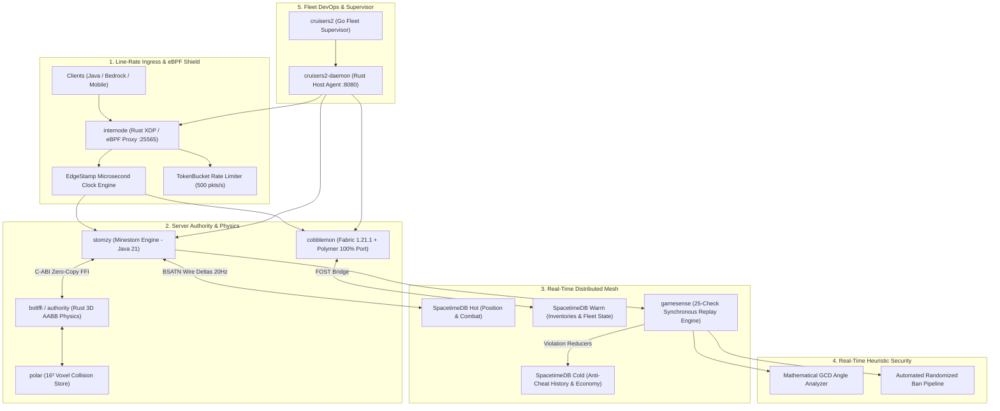

<div align="center">

# ⚡ TERRORIFY

### Next-Generation Distributed Gaming Infrastructure & High-Frequency Virtual Worlds

[](https://www.rust-lang.org/)
[](https://openjdk.org/)
[](https://golang.org/)
[](https://ebpf.io/)
[](https://spacetimedb.com/)
[](https://fabricmc.net/)

<p align="center">
  <b>Terrorify</b> pioneers high-performance game server architecture, line-rate eBPF network shields, zero-allocation physics engines, real-time distributed database synchronization, and server-side virtualization engines.
</p>

---

[🌐 Ecosystem](#-core-ecosystem) • [🏛️ Architecture](#-system-architecture) • [⚡ Technology Stack](#-technology-stack) • [🛡️ Security & Anti-Cheat](#-security--gamesense-engine) • [🚀 Repositories](#-flagship-repositories)

---

</div>

<br/>

## 🏛️ System Architecture

Our distributed topology decouples ingress networking, physics simulation, anti-cheat heuristics, and game state into specialized high-throughput layers:



<br/>

## 🌐 Core Ecosystem

### 🚀 High-Frequency Game Engines & Virtualization
* **[`stomzy`](https://github.com/terrorify/stomzy)** — Low-latency, multi-threaded Minestom JVM server engine engineered for ultra-dense multiplayer instances.
* **[`authority`](https://github.com/terrorify/authority)** & **`boltffi`** — Standalone native 3D AABB physics simulation and line-of-sight raycasting engine written in pure Rust, bridged to the JVM via zero-copy C-ABI FFI.
* **[`cobblemon`](https://github.com/terrorify/cobblemon)** — Pure server-side Polymer virtualized Cobblemon 1.7.3 expansion on Fabric 1.21.1 with 100% dual-compatibility across official modpacks and vanilla clients.
* **[`fost`](https://github.com/terrorify/fost)** — *Fabric of Spacetime*: Real-time Fabric server state synchronization adapter connecting Minecraft worlds directly to SpacetimeDB reducers.

### 🛡️ Networking, Ingress & Anti-Cheat
* **[`internode`](https://github.com/terrorify/internode)** — Rust-native edge ingress proxy featuring kernel-space eBPF/XDP volumetric DDoS mitigation and microsecond-accurate packet timestamps (`EdgeStamp`).
* **[`gamesense`](https://github.com/terrorify/gamesense)** — High-precision, zero-false-positive anti-cheat engine combining mathematical GCD angle analysis, rolling balance clocks, and deterministic replay verification.

### 🛰️ Fleet Orchestration & Cloud Control
* **[`cruisers2`](https://github.com/terrorify/cruisers2)** — Distributed container and game server fleet management daemon (Rust) with a robust CLI supervisor (Go) for automated deployment and health telemetries.
* **[`dashvue`](https://github.com/terrorify/dashvue)** — Web management dashboard and real-time observability portal for game server fleets, live player graphs, and violation review queues.

<br/>

---

## ⚡ Technology Stack

<div align="center">

| Domain | Technologies & Frameworks | Key Purpose |
|:---|:---|:---|
| **Core Systems** | `Rust`, `Java 21`, `Go`, `C-ABI` | High-frequency computing, memory safety & native FFI |
| **Ingress & Networking** | `eBPF / XDP`, `Netty`, `Krypton`, `Velocity` | Line-rate DDoS protection & zero-latency routing |
| **Server Virtualization** | `Minestom`, `Fabric Loader`, `Polymer Core`, `SGUI` | High-tickrates, headless instances & pure server-side assets |
| **Distributed State** | `SpacetimeDB`, `BSATN`, `H2 / RocksDB` | Microsecond relational subscriptions & persistent fleet state |
| **Physics & Compute** | `3D AABB`, `Polar 16³ Voxels`, `Raycasting` | Deterministic server-authoritative physics & movement validation |
| **DevOps & Fleet** | `Docker`, `Woodpecker CI`, `Cruisers2`, `Linux K8s` | Atomic deployments, instant rollbacks & automated fleet scaling |

</div>

<br/>

---

## 🛡️ Security & GameSense Engine

> [!IMPORTANT]
> **Zero-Trust Client Authority**: All movement, combat calculations, inventory transactions, and block interactions are strictly computed server-side via native deterministic Rust physics pipelines.

```
       [ Client Input Packet ]
                  │
                  ▼
       [ internode (XDP Shield) ] ── (TokenBucket + EdgeStamp)
                  │
                  ▼
       [ stomzy / Fabric Engine ]
                  │
        ┌─────────┴─────────┐
        ▼                   ▼
 [ boltffi (Physics) ]  [ gamesense (Heuristics) ]
        │                   │
        │ 3D Raycast / AABB │ Microsecond Timer Balance
        │ Voxel Collision   │ Greatest Common Divisor (GCD)
        ▼                   ▼
   [ Server State ] ──▶ [ SpacetimeDB Audit Trail ]
```

<br/>

---

## 🌟 Flagship Repositories

| Repository | Purpose | Language / Stack | Status |
|:---|:---|:---|:---|
| [**`terrorify/cobblemon`**](https://github.com/terrorify/cobblemon) | Server-side Polymer Cobblemon engine with 1:1 modpack interop | `Java` • `Fabric 1.21.1` • `Polymer` |  |
| [**`terrorify/stomzy`**](https://github.com/terrorify/stomzy) | Next-gen Minestom JVM server engine & instanced worlds | `Java 21` • `Minestom` |  |
| [**`terrorify/authority`**](https://github.com/terrorify/authority) | Deterministic 3D physics & raycasting calculation engine | `Rust` • `C-ABI FFI` |  |
| [**`terrorify/internode`**](https://github.com/terrorify/internode) | Ingress edge proxy with eBPF/XDP packet mitigation | `Rust` • `eBPF` • `XDP` |  |
| [**`terrorify/gamesense`**](https://github.com/terrorify/gamesense) | Mathematical anti-cheat engine & synchronized replay log | `Java` • `Rust` • `SpacetimeDB` |  |
| [**`terrorify/cruisers2`**](https://github.com/terrorify/cruisers2) | Distributed fleet orchestration & supervisor daemon | `Go` • `Rust` • `Docker` |  |

<br/>

---

<div align="center">

### 🤝 Contributing & Community

We are building the future of high-frequency multiplayer worlds and low-latency distributed networks.

[](https://terrorify.dev)
[](https://github.com/terrorify)

<sub>Designed with precision for the **Terrorify** Ecosystem. © 2026 Terrorify. All rights reserved.</sub>

</div>